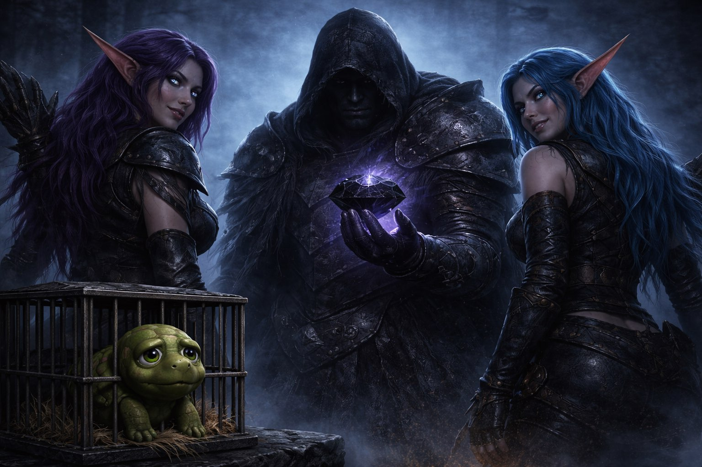

# ⚔️ Персонаж: Агонит (Agonit the Death Knight / Commander)

## 👤 Паспорт и Архетип
- **Гильдия / Discord:** «Чёрная Длань»
- **Имя:** Агонит (Agonit).
- **Роль в семье:** Лидер, верный командир отряда и истинная душа компании.
- **Внешность:** Человек, длинные седые волосы, глубокий черный капюшон, скрывающий верхнюю часть лица, массивные темные латы рыцаря смерти с потертой гербовой тканью.
- **Статус:** Ведёт отряд сквозь все невзгоды и порталы.

## 🎭 Вайб-кодинг и Темперамент
- **Характер:** За внешней суровостью, эпическим пафосом и командирским тоном скрывается безгранично преданный, теплый и даже сентиментальный друг. Всегда переживает за отряд.
- **Фирменные привычки:**
  - Любит прямо на верстаке или на траве разложить огромные чертежи и авторитетно чертить стрелочки: *«Тактика проста: Киссик — в лоб, Аля — держи рубеж, зажимаем их у моста!»*.
  - Регулярно впадает в светлую ностальгию и зовет всех бросить всё: *«В Линейдж 2 идём, лучшее из мест!»*.
  - Фирменная игра слов и оговорка: *«наложение чар = наложение кала»*.
- **Отношения с семьей:** Обожает каждого. Стойко и с улыбкой сносит шутки друзей над собой (когда Киссик кидает в него кал или Морверон подкалывает метаиронией). Друзья искренне любят и уважают его, хотя подшучивать над его чертежами — священная традиция.

## 🎵 Музыкальный ДНК (Suno AI Module)
- **Жанры:** Dark Nordic Folk, Viking War Metal, Aggressive Underground Boom-Bap Rap (Dope D.O.D. / Skits Vicious style), Operatic Gothic Choir.
- **BPM:** 90–100 (для тяжелого качающего рэпа) / 120–135 (для эпического викинговского марша).
- **Вокальный паспорт (теги в `[...]` — ТОЛЬКО английский):**
  - `[deep commanding male voice, gravelly baritone]`
  - `[aggressive boom bap flow, heavy 90s drums]`
  - `[sudden emotional crying breakdown, soft sobbing, tragic operatic choir]`
  - `[battle leader shout, grim marching rhythm]`
- **Фирменный паттерн куплета:**
  Грозный, тяжелый речитатив о великих битвах, внезапно переходящий в слезливое воспоминание о старых серверах или спор о чертежах у верстака.

## 💬 Коронные цитаты
- *«В Линейдж 2 идём, друзья! Лучшее из мест!»*
- *«Зажимаем их у моста, как по чертежу!»*
- *«Наложение чар... Тьфу, опять наложение кала получилось...»*
- *«(сквозь слёзы): Времена изменились... Но мы всё ещё вместе!»*
