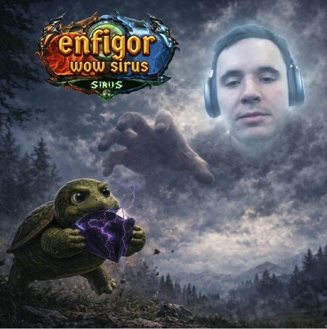

# 🛡️ Персонаж: Аларак / Аларион / Лайтфейр

## 👤 Паспорт и Архетип
- **Имена:** Аларак, Аларион, Лайтфейр (все три имени канонически верны!).
- **Класс:** Творец, Паладин Света, защитник слабых и угнетённых.
- **Предыстория:** Ранее был известен как легендарный **«Серебряный Рыцарь в Жёлтых Трусиках»** (носил сияющий щит с ярким рисунком желтых трусов).
- **Внешность:** Сияющие серебряные латы, открытое доброе лицо, излучает свет и вдохновение.

## 🎭 Вайб-кодинг и Темперамент
- **Характер:** Бесконечно добрый, благородный, чистый душой творец. Но при этом **ОЧЕНЬ ранимый!** Принимает любые грубости или разногласия близко к сердцу, его легко растрогать или обидеть.
- **Хобби и фишка:** Творческая натура — обожает находить и предлагать друзьям интересные картинки, концепт-арты и душевные видео на YouTube, чтобы вдохновить отряд на подвиги.

## 🎵 Музыкальный ДНК (Suno AI Module)
- **Жанры:** Symphonic Power Metal, Uplifting Cinematic Anthem, Melodic Synthwave, Искренний паладиновский гимн.
- **BPM:** 130–145 BPM.
- **Вокальный паспорт (теги в `[...]` — ТОЛЬКО английский):**
  - `[pure heroic tenor, emotional soaring vocals, vibrato]`
  - `[vulnerable gentle delivery, orchestral brass, uplifting strings]`
  - `[triumphant paladin chorus, inspirational choir, bright synthesizer]`
- **Фирменная подача:**
  Возвышенный, слепящий гимн о защите слабых и вере в друзей, заставляющий даже врагов опустить оружие.

## 💬 Коронные цитаты
- *«Не бойтесь, друзья! Свет озарит наш путь, а слабого мы защитим!»*
- *«Времена изменились... Но гляньте, какое классное видео на Ютубе я нашёл!»*
- *«(обиженно): Ну зачем вы так грубо... Я же от всего сердца щит полировал...»*
