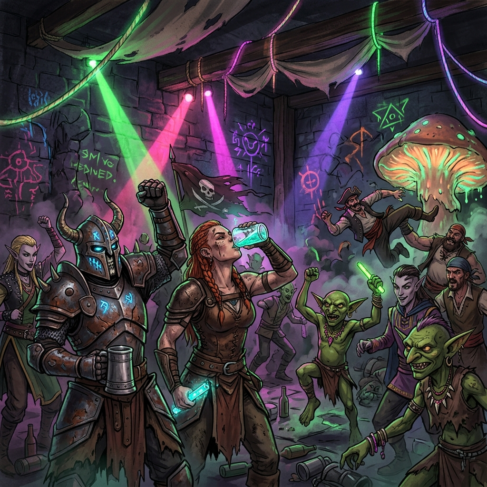

# 🍷 Персонаж: Светлана Баскова (Примадонна Рейва)



## 👤 Паспорт и Архетип
- **Гильдия / Discord:** «Чёрная Длань»
- **Имя:** Светлана Баскова.
- **Амплуа:** 40-летняя алкашка, примадонна таверн, королева эпатажа и внезапного трэша.
- **Внешность:** Растрёпанные волосы, бокал с крепким пойлом, помятое бархатное платье.

## 🎭 Вайб-кодинг: Двойной Контраст
- **Главный коронный приём:**
  Мгновенный переход от томной, нежной, ласковой феи к пропитому, хриплому, истошному базарному визгу на весь клуб!

## 🎵 Музыкальный ДНК (Suno AI Module)
- **Жанры:** Cabaret Acidcore, Trash Electroclash, Berlin Club Techno.
- **Вокальный паспорт (теги в `[...]` — ТОЛЬКО английский):**
  ```text
  [spoken word, no music, soft warm female voice, gentle, sweet, feathers rustling]
  Привет, мои золотые... Вы готовы к сказке?..
  
  [spoken word, no music, raspy drunk voice, hysterical laughter, screaming]
  ХОБА! НЕ ОЖИДАЛИ, БЛ***?! ПОГНАЛИ, НА***!
  
  [INSTANT DROP, hard kick in immediately, acid bass, no buildup, maximum energy, chorus]
  ```
