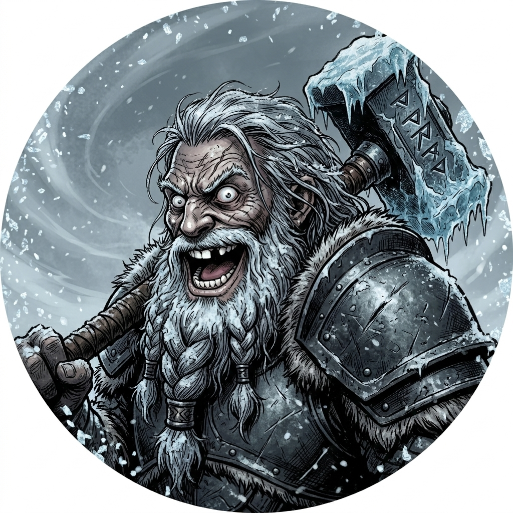

# 🔨 Персонаж: Борг / Берджерджил (Великая Трилогия Перерождений)



## 👤 Паспорт и Архетип
- **Гильдия / Discord:** «Чёрная Длань»
- **Имя:** Борг (Bergerjil). 
- **Эволюция душ:** Fogwind (эльфийка-лучница) ➔ Валенар (гном-маг / кулинар) ➔ **Борг** (дворф-шаман-кузнец).
- **Внешность:** Коренастый крепкий дворф с огненно-рыжей заплетенной бородой, в тяжелых кованых латах и с кузнечным молотом / боевым топором. На лице — добродушное, но безумное выражение.
- **Статус:** Полноправный член семьи, чудаковатый гений наковальни. **Именно он идёт на новый сервер WoW Forever!**

## 🎭 Вайб-кодинг и Темперамент
- **Характер:** Немного чудаковатый, увлеченный своим делом, добрый. Это не наивный дурачок, а наш родной дворф, который всей душой готов покорять новые горизонты.
- **Память прошлых жизней (Мета-травма):**
  Посреди боя, ковки или песни у него случаются внезапные сбои в матрице:
  - *«Постойте... Почему у меня борода?! Я же только что была эльфийкой в лесу...»*
  - *«Где моя поварёшка?! Кто суп из моркови доварит?! В КоА надо бежать, Сын Бронзбирда найден!»*
- **Мемы и фишки:**
  - Легендарная связка: *«А Борг... шаман... дворф... кузнец... А БОРГ ШАМАН ДВОРФ КУЗНЕЦ!!!»*.
  - Постоянно сбегает или теряется тотем (*«тотем опять ушёл!»*).
  - Специфический душок из кузницы.
  - Морверон постоянно рофлит, что хочет стать Боргом.

## 🎵 Музыкальный ДНК (Suno AI Module)
- **Жанры:** Dwarven Industrial Folk, Robotic Absurd Synth-Pop, Heavy Anvil Percussion, Epic Chanting.
- **BPM:** 125–140.
- **Вокальный паспорт (теги в `[...]` — ТОЛЬКО английский):**
  - `[dwarven gruff voice, heavy accent, rhythmic chanting]`
  - `[spoken, robotic pitch shift, reverb, echo]`
  - `[anvil percussion, clanging metal, forge bellows fx]`
  - `[sudden confused pause, past-life identity crisis, triumphant dwarven roar]`
- **Фирменный роботизированный дроп:**
  ```text
  [spoken, robotic pitch shift, reverb, echo]
  А Борг... шаман... дворф... кузнец...
  А БОРГ ШАМАН ДВОРФ КУЗНЕЦ!!!
  [heavy anvil drop, driving industrial folk kick]
  ```

## 💬 Коронные цитаты
- *«Кузнец готов! Тотем... стоп, куда опять тотем ушёл?!»*
- *«Прогрелись в котле — теперь мы готовы! Надели оковы!»*
- *«Я помню лук и стрелы... И морковный суп... И молот... Ай, куй железо!»*
