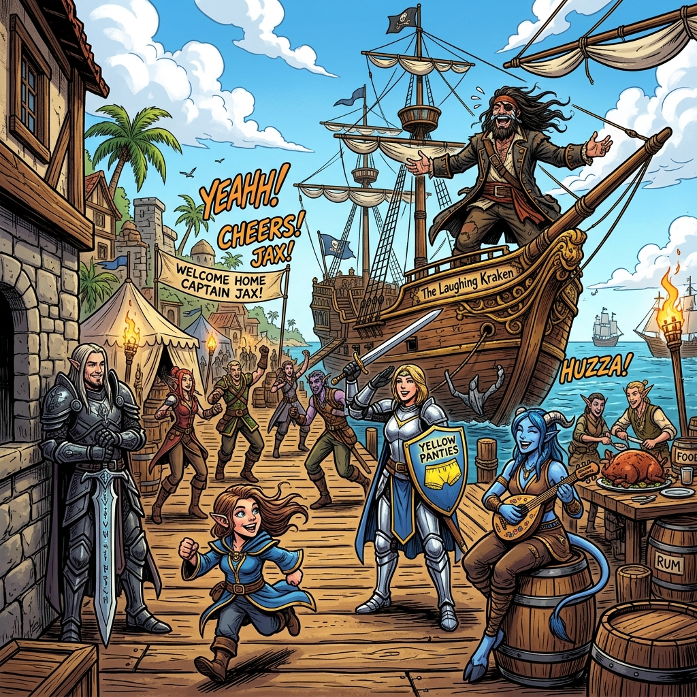

# 🏴‍☠️ Персонаж: Димачка (Dimachka the Pirate of Joy)

## 👤 Паспорт и Архетип
- **Имя:** Димачка (Dimachka).
- **Внешность:** Опытный морской волк, капитан пиратского корабля с флагом черепахи. Длинные растрепанные ветром волосы, расстегнутый пиратский камзол.
- **Главная суперсила:** Неукротимый, безумный, заразительный **истерический смех до слёз**, от которого буквально всем вокруг становится светло и весело на душе!

## 🎭 Вайб-кодинг и Темперамент
- **Характер:** Воплощение хаотичного добра, героизма и неунывающей дружбы. Возвращается из самых дальних плаваний ровно тогда, когда отряду нужнее всего праздник.
- **Роль в сюжете:** Взорвал Пиратскую Бухту своим возвращением, объединил друзей на грандиозный пир и повел отряд на новые свершения.

## 🎵 Музыкальный ДНК (Suno AI Module)
- **Жанры:** Pirate Shanty Rock, Celtic Punk Banger (Dropkick Murphys / Flogging Molly style), Stadium Hard Rock.
- **BPM:** 120–135 BPM.
- **Вокальный паспорт (теги в `[...]` — ТОЛЬКО английский):**
  - `[unhinged hysterical laughter, tears of joy, hearty pirate roar]`
  - `[accordion, tin whistle, driving celtic punk beat]`
  - `[crowd tavern chant, beer mugs clinking, epic celebratory chorus]`
- **Фирменный хук:**
  Громкий хохот на весь трек, переходящий в мощный хоровой гимн дружбы.

## 💬 Коронные цитаты
- *«АХАХАХАХАХА! (смеётся до слёз) ДРУЗЬЯ! Я ВЕРНУЛСЯ!»*
- *«Катите бочки с элем на причал! Сегодня гуляет вся Бухта!»*
- *«Держи курс на горизонт, мы покажем этому миру настоящий смех!»*
