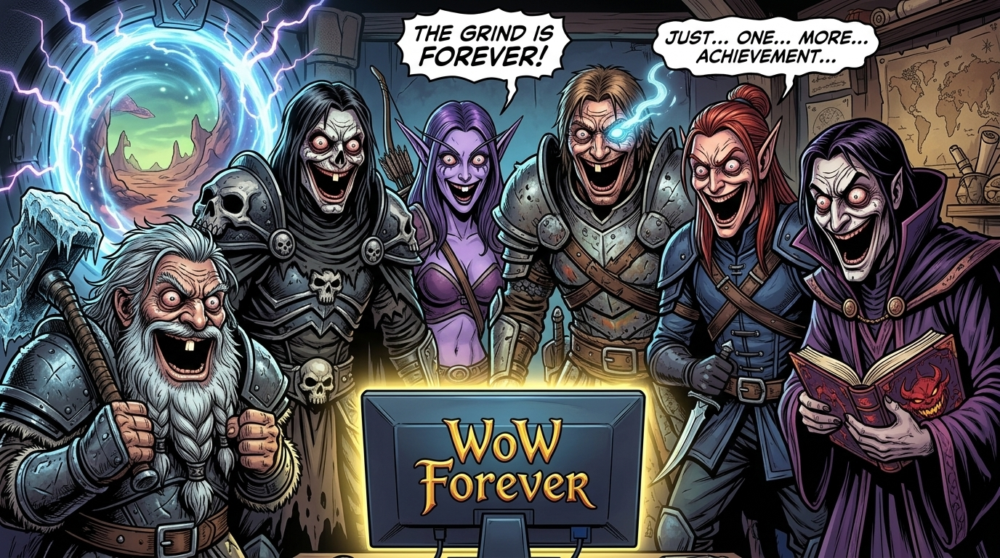

# 🔮 Персонаж: Эдвард Хейнд (Edward Haynd the Sims Master)

## 👤 Паспорт и Архетип
- **Гильдия / Discord:** «Чёрная Длань»
- **Имя:** Эдвард Хейнд (Edward Haynd).
- **Класс:** Чернокнижник (Warlock), мастер алхимии и темных искусств.
- **Внешность:** Худой, высокий человек, длинный выразительный нос, длинные темные волосы, струящиеся фиолетовые и черные магические одеяния с рунической вязью.

## 🎭 Вайб-кодинг и Темперамент
- **Характер:** Загадочный, жутковатый, говорит тихим двухголосым тоном (мужской и женский обертоны одновременно). При всей мрачности — верный и надежный член семьи.
- **Великий Секрет:** В тайном подвале запускает **The Sims 4**, где запер Мишу и Борга и ставит над ними бытовые эксперименты!
- **Специализация:** Варит дикие зелья из яда, теней и жабьих лапок (*«Пей, витязь, и стань сильнее... или захмелей от пяток Киссика»*).

## 🎵 Музыкальный ДНК (Suno AI Module)
- **Жанры:** Dark Witch House, Sinister Atmospheric Trap, Dark Electro, Двухголосый шепот.
- **BPM:** 110–130.
- **Вокальный паспорт (теги в `[...]` — ТОЛЬКО английский):**
  - `[whispering warlock, dual octave voice, eerie male and female harmony]`
  - `[sinister atmospheric synths, bubbling potion sound fx]`
  - `[creepy echo, dark witch house bass, mysterious cadence]`
- **Фирменная подача:**
  Мистический шепот под бульканье котлов, перерастающий в тягучий темный бас.

## 💬 Коронные цитаты
- *«Я сварю зелье из яда и древних теней... Главное, не перепутать с похлёбкой Борга.»*
- *«В моём подвале Sims 4 Миша снова застрял у бассейна без лестницы...»*
- *«Я захмелел... от аромата пяток Киссика!»*
