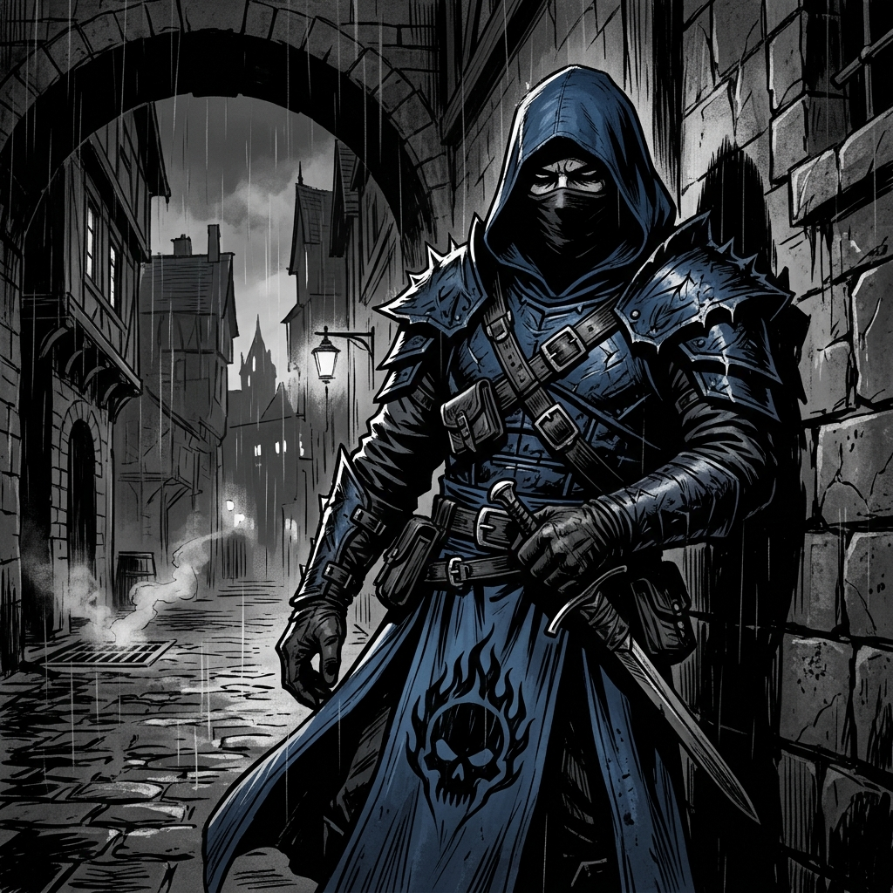

# 🗡️ Персонаж: Галедар (Galedar the Shadow Agent)

## 👤 Паспорт и Архетип
- **Имя:** Галедар (Galedar).
- **Класс:** Разбойник (Rogue), тайный агент ордена The Ember Skull Covenant (знак пылающего черепа).
- **Внешность:** Эльф крови (бывший человек), темные кожаные доспехи с острыми наплечниками, синий плащ с пылающим черепом, капюшон и маска, закрывающая лицо.
- **Статус:** Двойной агент, чья священная миссия — спасти Туртлу (Черепашку).

## 🎭 Вайб-кодинг и Темперамент
- **Характер:** Любознательный, скрытный, циничный философ в стиле нуара Макса Пэйна.
- **Фирменное появление:** **Подключается всегда в самый последний момент!** Когда весь отряд уже в хаосе, из тени выходит Галедар с тихой убийственной репликой или спасительным ударом.
- **Мемы:** Скрывается в Dying Light среди толп зомби, глядя на окружающих с высоты своего интеллекта: *«Кому я тут объясняю?! Опять одни дураки вокруг!»*.

## 🎵 Музыкальный ДНК (Suno AI Module)
- **Жанры:** Neo-Noir Trip-Hop, Dark Jazz (Max Payne style), Rainy Boom-Bap, Cold Spoken Word.
- **BPM:** 80–90 BPM.
- **Вокальный паспорт (теги в `[...]` — ТОЛЬКО английский):**
  - `[cold noir monologue, whispered cigarette baritone, rain ambience]`
  - `[vinyl crackle, smooth jazzy saxophone, slow boom bap drums]`
  - `[cynical late-entry punchline, deadpan delivery]`
- **Фирменная сцена:**
  Музыка затихает до шуршания дождя и саксофона, Галедар произносит нуарную речь о бренности бытия, после чего отряд снова взрывается рейвом.

## 💬 Коронные цитаты
- *«Кому я тут объясняю?! Опять одни дураки вокруг!»*
- *«Они считают меня оружием. Агонит считает тенью. Но моя цель — Туртла.»*
- *«Вы опять всё испортили... Придётся решать вопрос ножом.»*
