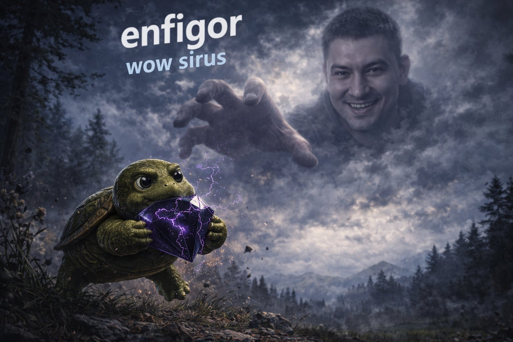

# 🧊 Персонаж: Злой Миша с Сируса (The Bald Troll of Sirus)

## 👤 Паспорт и Архетип
- **Имя:** Миша Прокажённый.
- **Внешность:** Похож на лысого клыкастого тролля. Сидит на ледяных скалах WoW Sirus, сжимая в когтях фиолетовый Чёрный Алмаз.
- **Роль:** Главный антагонист, архитектор коварных ловушек (включая аферу с презентацией «WoW Forever»).

## 🎭 Вайб-кодинг и Секрет Победы
- **Характер:** Невероятно агрессивный, вечно обиженный на весь белый свет, обзывает всех подряд, шипит, ревнует к синим эльфам и строит пакости.
- **СЕКРЕТ ПОБЕДЫ НАД МИШЕЙ:**
  **Мишу побеждают ЛЮБОВЬЮ и тёплыми дружескими объятиями!**
  В глубине души Миша вовсе не такой уж и гетеросексуал, хотя изо всех сил пытается казаться брутальным и свирепым. Когда весь отряд раскрывает руки, подходит к нему с улыбками и крепко, душевно обнимает его — вся агрессия Миши испаряется. Он краснеет, смущается, заикается и тает от ласки!

## 🎵 Музыкальный ДНК (Suno AI Module)
- **Жанры:** Icy Black Metal Trap, Aggressive Distorted Hip-Hop, внезапно переходящий в сентиментальный Soft Pop при объятиях.
- **BPM:** 140 / 70 (half-time).
- **Вокальный паспорт (теги в `[...]` — ТОЛЬКО английский):**
  - `[angry bald troll growl, hostile screaming, heavy distorted 808]`
  - `[sudden awkward silence, vinyl stop, heartbeat sound fx]`
  - `[confused blushing whisper, soft warm strings, gentle acoustic embrace]`
- **Фирменный поворот:**
  Миша орет ядовитый дисс на всех, но посреди дропа слышится: *«[group hug, warm embrace]»*, и Миша растерянно пищит: *«Эй... вы чего... отпустите... ладно, обнимите еще...»*.

## 💬 Коронные цитаты
- *«Ненавижу вас всех! Сидите в своих котлах! Чёрный Алмаз мой!»*
- *«Чего вы лыбитесь?! Я вас уничто... Ой... Почему вы меня обнимаете?!»*
- *«(краснея): Прекратите... Мне же... ну приятно вообще-то...»*
