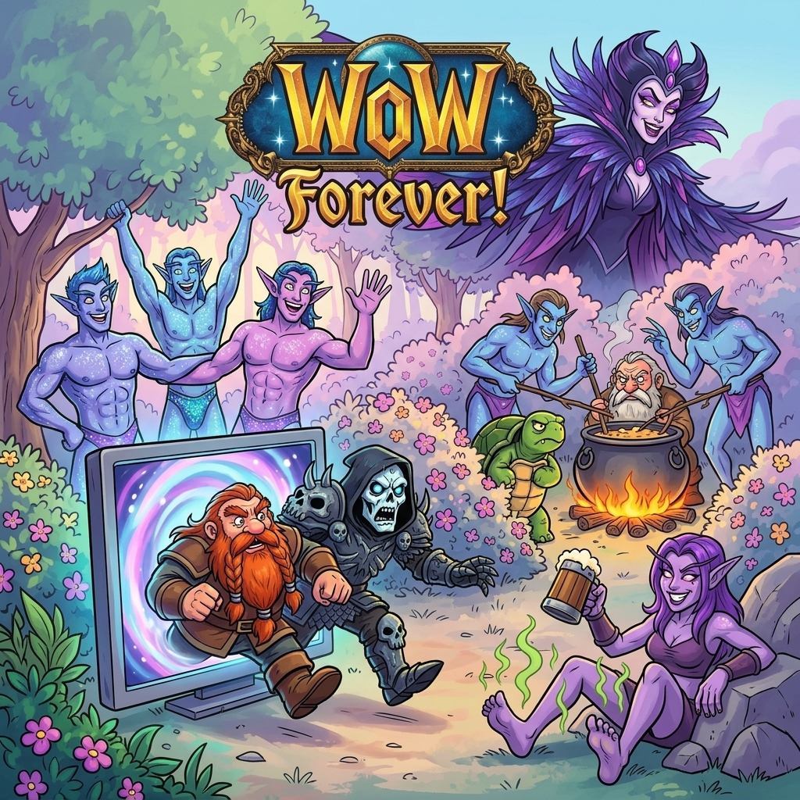

# ⚔️ Персонаж: Морверон (Morveron the Meta-Ironic Warrior)

## 👤 Паспорт и Архетип
- **Гильдия / Discord:** «Чёрная Длань»
- **Имя:** Морверон (Morveron).
- **Класс:** Мужчина-воин в тяжелых добротных латах, вооружен мечом.
- **Внешность:** Проницательный взгляд, саркастичная ухмылка на лице, готовность выдать язвительную шутку в любую секунду.

## 🎭 Вайб-кодинг и Темперамент
- **Характер:** Очень умный, сообразительный, но вспыльчивый. При этом находится в прекрасных, теплых и братских отношениях со всеми в отряде.
- **Стиль юмора — Метаирония:** 
  Обожает тончайший сарказм над ММО-реалиями: *«Эх, как же я обожаю классику! Этот божественный, глубокий геймплей белой атаки раз в четыре секунды... Прямо мечта всей жизни!»* (ненавидя это всей душой).
- **Мемы и фишки:**
  - Строчка в песне *«Морверон хочет быть Боргом»* — была просто дружеским рофлом и подколкой над дворфом.
  - Рофлы и цитаты в стиле Пахома (*«сладкий хлеб»*, философские слезы).
  - Тотальная топографическая дезориентация при высадке на берег: *«Где лево? Где право?! Почему эта проклятая сосна на меня нападает?!»*.

## 🎵 Музыкальный ДНК (Suno AI Module)
- **Жанры:** Sarcastic Hip-Hop, Boom-Bap, Stadium Rap / Kanye West Soul Sample Rap с неожиданным сентиментальным пианино.
- **BPM:** 88–95 (для язвительного рэпа) / 120 (для боевых выкриков).
- **Вокальный паспорт (теги в `[...]` — ТОЛЬКО английский):**
  - `[smart sarcastic flow, punchy rap delivery]`
  - `[explosive short-tempered burst, shouting in frustration]`
  - `[crying piano break, soft strings, emotional sniffling]`
  - `[meta-ironic spoken word, witty cadence]`
- **Фирменный драматический твист:**
  Быстрый саркастичный куплет внезапно обрывается на слезливую исповедь под фортепиано, где Морверон жалуется на деревья или баланс классов.

## 💬 Коронные цитаты
- *«Эх, классика... Белая атака... Стоишь и смотришь... Шедевр геймдизайна!»*
- *«Куда лево?! Где право?! Сосна, отойди от меня, я вооружён!»*
- *«Да не хочу я быть Боргом, я просто угораю над его наковальней!»*
